# 🚗 SiniestroFácil — Microservicio `ms-denuncias`


Microservicio REST para **registrar y consultar denuncias de siniestros vehiculares**. Al registrar una denuncia, el servicio entrega de inmediato un **folio único** (`SF-AAAA-NNNNNN`) y deja la denuncia en estado `RECIBIDA`, a la espera de su procesamiento posterior. Las denuncias se guardan en **MySQL** y tanto la base de datos como el microservicio se ejecutan en **contenedores Docker** conectados por una red.

> Proyecto académico de la asignatura **JVY0101 – Java: Diseño y Construcción de Soluciones Nativas en Nube**, DUOC UC.

---

## 📑 Tabla de contenidos

1. [Tecnologías](#-tecnologías)
2. [Estructura del proyecto](#-estructura-del-proyecto)
3. [Requisitos previos](#-requisitos-previos)
4. [Instalación paso a paso](#-instalación-paso-a-paso)
5. [Base de datos MySQL en Docker](#-base-de-datos-mysql-en-docker)
6. [Ejecutar el microservicio](#-ejecutar-el-microservicio)
7. [Microservicio en Docker](#-microservicio-en-docker)
8. [Endpoints de la API](#-endpoints-de-la-api)
9. [Validaciones](#-validaciones)
10. [Manejo de errores](#-manejo-de-errores)
11. [Documentación con Swagger](#-documentación-con-swagger-openapi)
12. [Pruebas con Postman](#-pruebas-con-postman)
13. [Pruebas con Maven](#-pruebas-con-maven)
14. [Checklist de revisión](#-checklist-de-revisión)
15. [Solución de problemas](#-solución-de-problemas)
16. [Limitaciones y próximos pasos](#-limitaciones-y-próximos-pasos)
17. [Evidencias](#-evidencias)
18. [Equipo](#-equipo)

---

## 🛠 Tecnologías

| Tecnología | Versión | Para qué se usa |
|---|---|---|
| Java (OpenJDK) | 25 | Lenguaje del microservicio |
| Spring Boot | 4.1.1 | Framework base |
| `spring-boot-starter-webmvc` | 4.1.1 | API REST (controladores, JSON) |
| `spring-boot-starter-validation` | 4.1.1 | Validación de datos con Jakarta Bean Validation |
| `spring-boot-starter-data-jpa` | 4.1.1 | Persistencia con JPA / Hibernate |
| MySQL (imagen Docker) | 8.4 | Base de datos de las denuncias |
| `mysql-connector-j` | (gestionado por Spring Boot) | Driver JDBC de MySQL |
| Docker Desktop | Última | Contenedores de MySQL y del microservicio |
| Lombok | 1.18.x | Genera getters, setters y constructores |
| springdoc-openapi (`webmvc-ui`) | 3.1.1 | Documentación OpenAPI + Swagger UI |
| Maven Wrapper | 3.9.x | Compilar y ejecutar sin instalar Maven |
| Postman | Última | Pruebas automatizadas de la API |
| JUnit 5 | (incluido) | Prueba de carga del contexto |

---

## 📂 Estructura del proyecto

```
siniestrofacil/
├── ms-denuncias/                         # Microservicio de denuncias
│   ├── pom.xml                           # Dependencias y configuración Maven
│   ├── mvnw.cmd                          # Maven Wrapper para Windows
│   ├── DockerfileJar                     # Imagen Docker del microservicio
│   ├── docker/
│   │   ├── Dockerfile                    # Imagen Docker de MySQL
│   │   └── create.sql                    # Crea la base y la tabla denuncias
│   └── src/
│       ├── main/
│       │   ├── java/cl/siniestrofacil/denuncias/
│       │   │   ├── MsDenunciasApplication.java      # Clase principal
│       │   │   ├── controller/
│       │   │   │   └── DenunciaController.java      # Endpoints REST
│       │   │   ├── service/
│       │   │   │   └── DenunciaService.java         # Lógica de negocio y folio
│       │   │   ├── model/
│       │   │   │   └── Denuncia.java                # Entidad JPA (tabla denuncias)
│       │   │   ├── repository/
│       │   │   │   └── DenunciaRepository.java      # Acceso a MySQL con Spring Data JPA
│       │   │   ├── dto/
│       │   │   │   ├── DenunciaRequest.java         # Datos de entrada + validaciones
│       │   │   │   └── ErrorResponse.java           # Formato común de errores
│       │   │   └── exception/
│       │   │       ├── GlobalExceptionHandler.java  # Manejo centralizado de errores
│       │   │       └── DenunciaNoEncontradaException.java
│       │   └── resources/
│       │       └── application.properties           # Puerto 8081, Swagger y conexión a MySQL
│       └── test/java/cl/siniestrofacil/denuncias/
│           └── MsDenunciasApplicationTests.java
├── postman/
│   └── ms-denuncias.postman_collection.json         # Colección de pruebas automatizadas
└── docs/
    └── capturas/                                    # Evidencias de Swagger y Postman
```

### Arquitectura en capas

```
Cliente (Postman / Swagger / Front)
          │  HTTP + JSON
          ▼
┌──────────────────────┐
│  DenunciaController  │  ← recibe la petición y activa @Valid
└──────────┬───────────┘
           ▼
┌──────────────────────┐
│   DenunciaService    │  ← genera folio, fija estado RECIBIDA, guarda
└──────────┬───────────┘
           ▼
┌──────────────────────┐
│  DenunciaRepository  │  ← Spring Data JPA
└──────────┬───────────┘
           ▼
┌──────────────────────┐
│   MySQL 8.4          │  ← tabla denuncias (contenedor Docker)
└──────────────────────┘

Cualquier error → GlobalExceptionHandler → ErrorResponse (JSON uniforme)
```

### Arquitectura en Docker

```
                 Red Docker: siniestrofacil-net
┌──────────────────────────────────────────────────────────┐
│                                                          │
│  ┌────────────────────┐        ┌──────────────────────┐  │
│  │   ms-denuncias     │ JDBC   │ mysql-siniestrofacil │  │
│  │   (Spring Boot)    │──────► │     (MySQL 8.4)      │  │
│  │   puerto 8081      │        │     puerto 3306      │  │
│  └─────────┬──────────┘        └──────────┬───────────┘  │
└────────────┼──────────────────────────────┼──────────────┘
             │ 8081:8081                    │ 3306:3306
             ▼                              ▼
   Swagger / Postman (localhost)     Cliente MySQL (opcional)
```

Dentro de la red, el microservicio encuentra a MySQL por el **nombre del contenedor** (`mysql-siniestrofacil`), no por `localhost`.

---

## ✅ Requisitos previos

| Herramienta | Obligatoria | Cómo verificar |
|---|---|---|
| **Windows 10 / 11** con PowerShell | Sí | — |
| **JDK 25** | Sí | `java -version` |
| **Git** | Sí | `git --version` |
| **Docker Desktop** (con WSL 2) | Sí | `docker --version` |
| **Postman** (app de escritorio) | Para pruebas | Abrir la app |
| **Node.js + Newman** | Opcional (pruebas por terminal) | `newman -v` |
| IDE: **VS Code** (Extension Pack for Java) o **IntelliJ IDEA** | Recomendado | — |

> Docker requiere la **virtualización habilitada en la BIOS** (Intel VT-x / AMD-V). Puedes revisarlo en el *Administrador de tareas → Rendimiento → CPU → Virtualización: Habilitado*.

> No es necesario instalar Maven: el proyecto trae **Maven Wrapper** (`mvnw.cmd`), que descarga la versión correcta automáticamente.

---

## 📥 Instalación paso a paso

### Paso 1 — Instalar el JDK 25

1. Descarga el instalador `.msi` de un JDK 25 (por ejemplo **Microsoft Build of OpenJDK 25** o **Eclipse Temurin 25**).
2. Ejecuta el instalador. Si ofrece las opciones **"Set JAVA_HOME variable"** y **"Add to PATH"**, márcalas y listo (salta al punto 5).
3. Si no las ofrece, configúralas a mano:
   - Presiona `Win` y busca **"Editar las variables de entorno del sistema"** → botón **Variables de entorno**.
   - En *Variables del sistema* → **Nueva** → Nombre: `JAVA_HOME`, Valor: la carpeta del JDK (ej. `C:\Program Files\Microsoft\jdk-25.0.2-hotspot`).
   - Selecciona la variable `Path` → **Editar** → **Nuevo** → escribe `%JAVA_HOME%\bin` → **Aceptar** en todas las ventanas.
4. **Cierra y vuelve a abrir** la terminal (PowerShell o la terminal de VS Code) para que tome los cambios.
5. Verifica:

```powershell
java -version
# Debe mostrar: openjdk version "25..."

echo $env:JAVA_HOME
# Debe mostrar la carpeta del JDK
```

### Paso 2 — Clonar el repositorio

Abre **PowerShell** (o la terminal integrada de VS Code con `` Ctrl+` ``):

```powershell
git clone https://github.com/<usuario>/<repositorio>.git
cd <repositorio>\ms-denuncias
```

### Paso 3 — Compilar y descargar dependencias

```powershell
.\mvnw.cmd clean install -DskipTests
```

> La primera vez tarda un poco porque descarga Maven y todas las dependencias.
> Se usa `-DskipTests` porque la prueba de contexto necesita MySQL arriba (ver [Pruebas con Maven](#-pruebas-con-maven)).

Si todo está bien, verás al final:

```
[INFO] BUILD SUCCESS
```

### Paso 4 — Instalar Docker Desktop

1. Descarga **Docker Desktop para Windows (AMD64)** desde https://www.docker.com/products/docker-desktop/.
2. Ejecuta el instalador y deja marcada la opción **Use WSL 2 instead of Hyper-V (recommended)**.
3. Acepta los términos. Puedes iniciar sesión o presionar **Skip**.
4. Reinicia el PC si lo pide.
5. Abre Docker Desktop y espera a que abajo a la izquierda diga **Engine running**.
6. Verifica en PowerShell:

```powershell
docker --version
docker ps
```

### Paso 5 — Configurar Lombok en el IDE

Lombok genera código al compilar; el IDE necesita saberlo para no marcar errores falsos.

- **IntelliJ IDEA:** `Settings → Build, Execution, Deployment → Compiler → Annotation Processors` → marcar **Enable annotation processing**. Instalar el plugin *Lombok* si no viene incluido.
- **VS Code:** el *Extension Pack for Java* ya incluye soporte para Lombok. Si aparecen errores rojos, ejecutar `Java: Clean Java Language Server Workspace` desde la paleta de comandos (`Ctrl+Shift+P`).

---

## 🐬 Base de datos MySQL en Docker

El microservicio guarda las denuncias en MySQL, así que **MySQL debe estar corriendo antes de levantar el microservicio**.

| Dato | Valor |
|---|---|
| Contenedor | `mysql-siniestrofacil` |
| Base de datos | `siniestrofacil` |
| Usuario / contraseña | `sfuser` / `sfpass` |
| Contraseña de root | `root` |
| Puerto | `3306` |

### Paso 1 — Crear la red Docker

La red permite que el microservicio y MySQL se encuentren por su nombre. Se crea **una sola vez**:

```powershell
docker network create siniestrofacil-net
```

### Paso 2 — Construir la imagen de MySQL

Desde la carpeta `ms-denuncias\docker` (ahí están `Dockerfile` y `create.sql`):

```powershell
cd ms-denuncias\docker
docker build -t mysql-siniestrofacil .
```

> Ojo con el **punto final** (`.`): indica que el `Dockerfile` está en la carpeta actual.

### Paso 3 — Levantar el contenedor de MySQL

```powershell
docker run -d --name mysql-siniestrofacil --network siniestrofacil-net -p 3306:3306 mysql-siniestrofacil
```

Espera a que MySQL termine de iniciar (la primera vez tarda unos 20–30 segundos):

```powershell
docker logs -f mysql-siniestrofacil
```

Cuando aparezca `ready for connections` en la **última** parte del log, presiona `Ctrl + C` para salir del log (MySQL sigue corriendo).

### Paso 4 — Verificar la base de datos

```powershell
docker exec -it mysql-siniestrofacil mysql -u sfuser -p
```

Escribe la contraseña `sfpass` y luego:

```sql
USE siniestrofacil;
SHOW TABLES;
DESC denuncias;
```

Debe aparecer la tabla `denuncias` con sus 8 columnas. Para salir: `exit`.

---

## ▶️ Ejecutar el microservicio

> **Antes:** el contenedor `mysql-siniestrofacil` debe estar corriendo (ver sección anterior). Desde VS Code, el microservicio se conecta a MySQL en `localhost:3306`.

**Opción A — PowerShell**

```powershell
.\mvnw.cmd spring-boot:run
```

Para detenerlo: `Ctrl + C` en la terminal (si pregunta *"¿Desea terminar el trabajo por lotes (S/N)?"*, responde `S`).

**Opción B — Desde el IDE**

Abrir `MsDenunciasApplication.java` y presionar **Run** ▶️.

**Opción C — Ejecutar el JAR generado**

```powershell
.\mvnw.cmd clean package -DskipTests
java -jar target\ms-denuncias-0.0.1-SNAPSHOT.jar
```

### Verificar que está arriba

En la consola debe aparecer algo como:

```
Tomcat started on port 8081 (http)
Started MsDenunciasApplication in X.XXX seconds
```

Luego abre en el navegador: **http://localhost:8081/** → debería cargar Swagger UI.

### Configuración (`application.properties`)

```properties
spring.application.name=ms-denuncias
server.port=8081
# abrir Swagger UI en la raiz (http://localhost:8081/)
springdoc.swagger-ui.use-root-path=true

# conexion a MySQL
# los valores despues de ":" se usan al ejecutar desde VS Code (MySQL en localhost)
# dentro de Docker se reemplazan con variables de entorno (DB_URL, DB_USER, DB_PASSWORD)
spring.datasource.url=${DB_URL:jdbc:mysql://localhost:3306/siniestrofacil}
spring.datasource.username=${DB_USER:sfuser}
spring.datasource.password=${DB_PASSWORD:sfpass}
spring.datasource.driver-class-name=com.mysql.cj.jdbc.Driver

# crear o actualizar las tablas a partir de las entidades
spring.jpa.hibernate.ddl-auto=update
spring.jpa.show-sql=true
spring.jpa.open-in-view=false
```

Gracias a las variables `${DB_URL:...}`, **no hay que editar este archivo** para pasar de VS Code a Docker: en Docker basta con enviar `-e DB_URL=...` al levantar el contenedor.

---

## 🐳 Microservicio en Docker

Aquí el microservicio se empaqueta como `.jar` y se ejecuta en su propio contenedor, conectado a MySQL por la red `siniestrofacil-net`.

> **Antes:** detén el microservicio si lo tienes corriendo en VS Code (`Ctrl + C`), porque ocupa el puerto 8081.

### Paso 1 — Generar el `.jar`

Desde la carpeta `ms-denuncias`:

```powershell
.\mvnw.cmd clean install -DskipTests
```

`clean` borra la carpeta `target` anterior. Al final debe decir `BUILD SUCCESS` y quedar el archivo `target\ms-denuncias-0.0.1-SNAPSHOT.jar`.

### Paso 2 — Construir la imagen del microservicio

El archivo `DockerfileJar` usa Java 25 (`eclipse-temurin:25-jre`) y copia el `.jar`:

```dockerfile
FROM eclipse-temurin:25-jre
ENV TZ=America/Santiago
WORKDIR /app
COPY target/ms-denuncias-0.0.1-SNAPSHOT.jar app.jar
EXPOSE 8081
ENTRYPOINT ["java", "-jar", "app.jar"]
```

```powershell
docker build -t ms-denuncias -f DockerfileJar .
```

### Paso 3 — Levantar el contenedor en la misma red que MySQL

```powershell
docker run -d --name ms-denuncias --network siniestrofacil-net -p 8081:8081 -e DB_URL=jdbc:mysql://mysql-siniestrofacil:3306/siniestrofacil ms-denuncias
```

| Parte del comando | Qué hace |
|---|---|
| `--name ms-denuncias` | Nombre del contenedor |
| `--network siniestrofacil-net` | Lo conecta a la misma red que MySQL |
| `-p 8081:8081` | Publica el puerto para Swagger y Postman |
| `-e DB_URL=...mysql-siniestrofacil:3306...` | Apunta a MySQL por el nombre del contenedor |

### Paso 4 — Verificar

```powershell
docker ps
docker logs ms-denuncias
```

- `docker ps` debe mostrar **2 contenedores** corriendo: `mysql-siniestrofacil` y `ms-denuncias`.
- En los logs debe aparecer `Started MsDenunciasApplication`.
- En Docker Desktop → **Containers** se ven ambos con el punto verde.
- Abre http://localhost:8081/ → Swagger UI (ahora servido desde el contenedor).

### Paso 5 — Comprobar que los datos llegan a MySQL

1. Registra una denuncia desde Swagger o Postman.
2. Consulta la tabla:

```powershell
docker exec -it mysql-siniestrofacil mysql -u sfuser -p
```

```sql
USE siniestrofacil;
SELECT folio, patente, estado, fecha_registro FROM denuncias;
```

La denuncia registrada debe aparecer en el resultado.

### Comandos útiles

| Acción | Comando |
|---|---|
| Ver contenedores corriendo | `docker ps` |
| Ver todos (incluso detenidos) | `docker ps -a` |
| Detener ambos | `docker stop ms-denuncias mysql-siniestrofacil` |
| Volver a iniciarlos (primero MySQL) | `docker start mysql-siniestrofacil` y luego `docker start ms-denuncias` |
| Ver logs del microservicio | `docker logs -f ms-denuncias` |
| Reconstruir tras cambiar código | `docker rm -f ms-denuncias` → Paso 1, 2 y 3 de nuevo |
| Borrar todo (incluye datos) | `docker rm -f ms-denuncias mysql-siniestrofacil` y `docker network rm siniestrofacil-net` |

---

## 🔌 Endpoints de la API

URL base: `http://localhost:8081`

| Método | Ruta | Descripción | Respuestas |
|---|---|---|---|
| `POST` | `/denuncias` | Registra una denuncia y entrega el folio | `201`, `400` |
| `GET` | `/denuncias/{folio}` | Consulta una denuncia por su folio | `200`, `404` |

### 1. Registrar denuncia — `POST /denuncias`

**Request:**
```json
{
  "patente": "ABCD12",
  "rutAsegurado": "12345678-9",
  "numeroPoliza": "POL-001",
  "fechaSiniestro": "2026-09-28",
  "descripcion": "choque por alcance en semaforo"
}
```

**Response `201 Created`:**
```json
{
  "folio": "SF-2026-000001",
  "patente": "ABCD12",
  "rutAsegurado": "12345678-9",
  "numeroPoliza": "POL-001",
  "fechaSiniestro": "2026-09-28",
  "descripcion": "choque por alcance en semaforo",
  "estado": "RECIBIDA",
  "fechaRegistro": "2026-10-02T10:15:30.123456"
}
```

**Desde PowerShell:**
```powershell
$body = @{
    patente        = "ABCD12"
    rutAsegurado   = "12345678-9"
    numeroPoliza   = "POL-001"
    fechaSiniestro = "2026-09-28"
    descripcion    = "choque por alcance en semaforo"
} | ConvertTo-Json

Invoke-RestMethod -Method Post -Uri "http://localhost:8081/denuncias" `
    -ContentType "application/json" -Body $body
```

> Es más cómodo probar con **Postman** o **Swagger** (ver más abajo).

### 2. Consultar por folio — `GET /denuncias/{folio}`

```powershell
Invoke-RestMethod -Uri "http://localhost:8081/denuncias/SF-2026-000001"
```

También puedes abrir esa URL directamente en el navegador.

- `200 OK` → devuelve la denuncia completa.
- `404 Not Found` → el folio no existe (ver [Manejo de errores](#-manejo-de-errores)).

### Formato del folio

```
SF-2026-000001
│   │    └── correlativo de 6 dígitos (se reinicia al reiniciar el servicio)
│   └─────── año actual
└─────────── prefijo SiniestroFácil
```

---

## 🛡 Validaciones

Las validaciones están en `DenunciaRequest.java` y se activan con `@Valid` en el controlador.

| Campo | Reglas | Mensaje de error |
|---|---|---|
| `patente` | Obligatoria | `la patente es obligatoria` |
| | Formato chileno: `AA1234` (antiguo) o `ABCD12` (nuevo), **solo mayúsculas** | `formato de patente invalido` |
| `rutAsegurado` | Obligatorio | `el rut del asegurado es obligatorio` |
| `numeroPoliza` | Obligatorio | `el numero de poliza es obligatorio` |
| `fechaSiniestro` | Obligatoria | `la fecha del siniestro es obligatoria` |
| | No puede ser futura (hoy sí se acepta) | `la fecha del siniestro no puede ser futura` |
| | Formato `AAAA-MM-DD` | `la fecha debe tener formato AAAA-MM-DD` |
| `descripcion` | Obligatoria | `la descripcion es obligatoria` |
| | Máximo 500 caracteres | `la descripcion no puede superar 500 caracteres` |

**Expresión regular de la patente:**

```regex
^[A-Z]{2}\d{4}$|^[A-Z]{4}\d{2}$
```

| Ejemplo | ¿Válida? | Motivo |
|---|---|---|
| `ABCD12` | ✅ | Formato nuevo |
| `AB1234` | ✅ | Formato antiguo |
| `ABC123` | ❌ | No calza con ningún formato |
| `abcd12` | ❌ | Minúsculas |

> **Nota:** `@NotBlank` también rechaza textos con solo espacios (ej. `"  "`).

---

## ⚠️ Manejo de errores

Todos los errores pasan por `GlobalExceptionHandler` y responden con el mismo formato (`ErrorResponse`). El campo `errores` solo aparece cuando hay detalle por campo.

| Situación | Código | Excepción capturada |
|---|---|---|
| Datos que no cumplen las validaciones | `400` | `MethodArgumentNotValidException` |
| JSON mal formado o fecha con formato incorrecto | `400` | `HttpMessageNotReadableException` |
| Folio inexistente | `404` | `DenunciaNoEncontradaException` |

**Ejemplo `400` — validación fallida:**
```json
{
  "timestamp": "2026-10-02T10:20:00.000",
  "status": 400,
  "error": "Bad Request",
  "mensaje": "la denuncia tiene datos invalidos",
  "path": "/denuncias",
  "errores": {
    "fechaSiniestro": "la fecha del siniestro no puede ser futura",
    "patente": "formato de patente invalido"
  }
}
```

**Ejemplo `400` — fecha con formato incorrecto (`28-09-2026`):**
```json
{
  "timestamp": "2026-10-02T10:21:00.000",
  "status": 400,
  "error": "Bad Request",
  "mensaje": "el campo fechaSiniestro tiene un formato invalido",
  "path": "/denuncias",
  "errores": {
    "fechaSiniestro": "la fecha debe tener formato AAAA-MM-DD"
  }
}
```

**Ejemplo `400` — JSON mal formado:**
```json
{
  "timestamp": "2026-10-02T10:22:00.000",
  "status": 400,
  "error": "Bad Request",
  "mensaje": "el cuerpo de la peticion no es un json valido",
  "path": "/denuncias"
}
```

**Ejemplo `404` — folio inexistente:**
```json
{
  "timestamp": "2026-10-02T10:23:00.000",
  "status": 404,
  "error": "Not Found",
  "mensaje": "no existe una denuncia con folio SF-2026-999999",
  "path": "/denuncias/SF-2026-999999"
}
```

> Los errores de un mismo campo se unen con `; ` y los campos se ordenan alfabéticamente para que la respuesta sea siempre igual.

---

## 📘 Documentación con Swagger (OpenAPI)

La documentación se genera automáticamente con **springdoc-openapi** a partir de los controladores y DTOs.

| Recurso | URL |
|---|---|
| Swagger UI (raíz) | http://localhost:8081/ |
| Swagger UI (ruta estándar) | http://localhost:8081/swagger-ui/index.html |
| Especificación OpenAPI (JSON) | http://localhost:8081/v3/api-docs |
| Especificación OpenAPI (YAML) | http://localhost:8081/v3/api-docs.yaml |

### Cómo probar desde Swagger

1. Levanta el microservicio y abre **http://localhost:8081/**.
2. Despliega **`POST /denuncias`** → clic en **Try it out**.
3. Pega el JSON de ejemplo en el cuerpo y presiona **Execute**.
4. Revisa el código de respuesta (`201`) y copia el `folio` generado.
5. Despliega **`GET /denuncias/{folio}`** → **Try it out** → pega el folio → **Execute**.
6. Prueba también con datos inválidos para ver las respuestas `400` y con un folio falso para ver el `404`.

### Dependencia en `pom.xml`

```xml
<dependency>
    <groupId>org.springdoc</groupId>
    <artifactId>springdoc-openapi-starter-webmvc-ui</artifactId>
    <version>3.1.1</version>
</dependency>
```

---

## 🧪 Pruebas con Postman

La colección `postman/ms-denuncias.postman_collection.json` contiene **13 peticiones con pruebas automatizadas** (scripts `pm.test`).

### Paso 1 — Importar la colección

1. Abre Postman → **Import**.
2. Selecciona el archivo `postman/ms-denuncias.postman_collection.json`.
3. Aparecerá la colección **"ms-denuncias - pruebas"**.

### Paso 2 — Revisar las variables

La colección trae sus propias variables (pestaña **Variables** de la colección):

| Variable | Valor | Uso |
|---|---|---|
| `baseUrl` | `http://localhost:8081` | URL del microservicio |
| `folio` | *(se llena sola)* | El primer POST guarda aquí el folio generado |

### Paso 3 — Ejecutar con el Collection Runner

1. Asegúrate de que el microservicio esté corriendo.
2. Clic derecho en la colección → **Run collection**.
3. **Ejecuta en el orden por defecto** (la consulta por folio usa el folio guardado por el primer POST).
4. Presiona **Run** y revisa que todas las pruebas queden en verde ✅.

### Casos cubiertos

**1. Registrar denuncia (casos válidos)** — esperan `201`

| Prueba | Qué verifica |
|---|---|
| Patente nueva (`ABCD12`) | Folio `SF-AAAA-NNNNNN`, año actual, estado `RECIBIDA`, datos devueltos, fecha de registro. Guarda el folio |
| Patente antigua (`AB1234`) | Acepta formato antiguo y genera un folio distinto |
| Fecha de hoy | La fecha actual no se considera futura |

**2. Consultar denuncia por folio**

| Prueba | Esperado |
|---|---|
| Folio existente | `200` con los datos registrados |
| Folio inexistente (`SF-2026-999999`) | `404` con mensaje `no existe una denuncia con folio ...` |

**3. Validaciones** — todas esperan `400` y un `mensaje` no vacío

| Prueba | Error esperado |
|---|---|
| Patente `ABC123` | `formato de patente invalido` |
| Patente en minúsculas `abcd12` | `formato de patente invalido` |
| Fecha futura `2099-01-01` | `la fecha del siniestro no puede ser futura` |
| Fecha `28-09-2026` | `la fecha debe tener formato AAAA-MM-DD` |
| Descripción de 501 caracteres | `la descripcion no puede superar 500 caracteres` |
| Campos obligatorios en blanco | Un error por cada campo vacío |
| Body vacío `{}` | Error en los 5 campos |
| JSON mal formado | `el cuerpo de la peticion no es un json valido` |

### (Opcional) Ejecutar por terminal con Newman

Requiere [Node.js](https://nodejs.org/) instalado. Desde la raíz del repositorio, en PowerShell:

```powershell
npm install -g newman
newman run postman\ms-denuncias.postman_collection.json
```

> Si PowerShell muestra *"la ejecución de scripts está deshabilitada en este sistema"*, ejecuta una sola vez:
> ```powershell
> Set-ExecutionPolicy -Scope CurrentUser RemoteSigned
> ```

> ℹ️ Las denuncias quedan guardadas en **MySQL**: al reiniciar el microservicio no se pierden y el folio continúa el correlativo (`000002`, `000003`, …). La colección funciona igual con el servicio en VS Code o en Docker, porque ambos usan `http://localhost:8081`.

> ℹ️ En `postman/collections/` hay peticiones sueltas antiguas que apuntan al puerto **8080**. El servicio corre en **8081**; usa la colección `ms-denuncias.postman_collection.json`, que ya tiene el puerto correcto.

---

## 🧰 Pruebas con Maven

El proyecto incluye una prueba que verifica que el contexto de Spring levanta correctamente. Como el contexto se conecta a la base de datos, **el contenedor `mysql-siniestrofacil` debe estar corriendo** antes de ejecutarla.

```powershell
.\mvnw.cmd test
```

Resultado esperado:

```
Tests run: 1, Failures: 0, Errors: 0, Skipped: 0
[INFO] BUILD SUCCESS
```

Para una verificación completa (compilar + probar + empaquetar):

```powershell
.\mvnw.cmd clean verify
```

---

## 📋 Checklist de revisión

Usa esta lista para revisar el proyecto antes de una entrega o un *pull request*:

**Instalación y ejecución**
- [ ] `java -version` muestra JDK 25
- [ ] `.\mvnw.cmd clean install -DskipTests` termina en `BUILD SUCCESS`
- [ ] El servicio levanta en el puerto `8081` sin errores

**Docker**
- [ ] `docker --version` responde y Docker Desktop dice *Engine running*
- [ ] Existe la red `siniestrofacil-net` (`docker network ls`)
- [ ] Contenedores `mysql-siniestrofacil` y `ms-denuncias` corriendo (`docker ps`)
- [ ] La tabla `denuncias` existe en MySQL (`DESC denuncias;`)
- [ ] Una denuncia registrada por Swagger/Postman aparece con `SELECT * FROM denuncias;`

**Swagger**
- [ ] `http://localhost:8081/` carga Swagger UI
- [ ] Aparecen los endpoints `POST /denuncias` y `GET /denuncias/{folio}`
- [ ] `http://localhost:8081/v3/api-docs` devuelve el JSON de OpenAPI

**Funcionalidad**
- [ ] `POST` válido responde `201` con folio `SF-AAAA-NNNNNN` y estado `RECIBIDA`
- [ ] `GET` con folio existente responde `200`
- [ ] `GET` con folio inexistente responde `404`

**Validaciones**
- [ ] Patente inválida o en minúsculas → `400`
- [ ] Fecha futura → `400`; fecha de hoy → `201`
- [ ] Fecha con formato `DD-MM-AAAA` → `400`
- [ ] Descripción > 500 caracteres → `400`
- [ ] Campos vacíos / body `{}` / JSON roto → `400`

**Postman**
- [ ] Colección importada y ejecutada con el Runner
- [ ] Todas las pruebas en verde

**Código**
- [ ] Sin errores de Lombok en el IDE
- [ ] `.\mvnw.cmd test` pasa sin fallos

---

## 🩺 Solución de problemas

| Problema | Causa probable | Solución |
|---|---|---|
| `release version 25 not supported` | El JDK activo no es el 25 | Instalar JDK 25, revisar `JAVA_HOME` y **reabrir la terminal** |
| `'java' no se reconoce como un comando...` | Falta `%JAVA_HOME%\bin` en el `Path` | Revisar el [Paso 1](#paso-1--instalar-el-jdk-25) y reabrir la terminal |
| `mvnw.cmd : El término no se reconoce...` | En PowerShell falta el `.\` o no estás en la carpeta | Entrar a `ms-denuncias` y usar `.\mvnw.cmd` |
| `Port 8081 was already in use` | Otro proceso (o una ejecución anterior) usa el puerto | En PowerShell: `netstat -ano \| findstr :8081` → anotar el PID → `taskkill /PID <PID> /F` |
| Errores rojos en `getFolio()`, `setPatente()`, etc. | El IDE no procesa Lombok | Habilitar *annotation processing* / limpiar workspace de Java |
| Swagger da `404` | El servicio no levantó o la URL está mal | Revisar consola y usar `/swagger-ui/index.html` |
| Postman: `Could not get response` | Servicio apagado o puerto incorrecto | Levantar el servicio y revisar que `baseUrl` sea `http://localhost:8081` |
| Prueba "Consultar folio existente" falla | Se ejecutó sola o fuera de orden | Ejecutar la colección completa en orden con el Runner |
| `Communications link failure` al iniciar | MySQL no está corriendo o aún está iniciando | `docker start mysql-siniestrofacil`, esperar `ready for connections` y volver a levantar el microservicio |
| Contenedor `ms-denuncias` se detiene solo | Arrancó antes que MySQL o no está en la red | `docker logs ms-denuncias`; verificar `--network siniestrofacil-net` y luego `docker start ms-denuncias` |
| `Bind for 0.0.0.0:3306 failed: port is already allocated` | Hay otro MySQL instalado en Windows usando el 3306 | Detener ese servicio MySQL de Windows, o usar `-p 3307:3306` (y en VS Code `DB_URL` con puerto 3307) |
| `Conflict. The container name ... is already in use` | Ya existe un contenedor con ese nombre | `docker rm -f <nombre>` y repetir el `docker run` |
| `docker: error during connect` | Docker Desktop no está abierto | Abrir Docker Desktop y esperar *Engine running* |
| `COPY failed: ... ms-denuncias-0.0.1-SNAPSHOT.jar: not found` | No se generó el `.jar` | Ejecutar `.\mvnw.cmd clean install -DskipTests` antes del `docker build` |
| `Virtualization support not detected` | Virtualización deshabilitada en la BIOS | Habilitar Intel VT-x / AMD-V en la BIOS (depende del fabricante) |
| `.\mvnw.cmd test` falla | MySQL no está corriendo | Levantar `mysql-siniestrofacil` y repetir |
| Advertencia `sun.misc.Unsafe` al compilar | Lombok usa una API antigua del JDK | Es solo una advertencia; no afecta la ejecución |

---

## 🚧 Limitaciones y próximos pasos

**Limitaciones actuales**
- Credenciales de MySQL de ejemplo dentro del `Dockerfile` (solo para entorno académico).
- El RUT solo se valida como obligatorio, no se verifica el dígito verificador.
- El estado queda fijo en `RECIBIDA` (aún no existe el procesamiento asíncrono).

**Próximos pasos sugeridos**
- [ ] `docker-compose.yml` para levantar MySQL y el microservicio con un solo comando
- [ ] Validador personalizado de RUT chileno (módulo 11)
- [ ] Procesamiento asíncrono para cambiar el estado de la denuncia
- [ ] Anotaciones `@Operation` / `@Schema` para enriquecer Swagger
- [ ] Pruebas unitarias del servicio y pruebas de controlador con MockMvc
- [ ] Despliegue de los contenedores en la nube (AWS)

---

## 📸 Evidencias

Capturas de las pruebas realizadas con el microservicio corriendo en `http://localhost:8081`.

### Swagger

**1. Swagger UI con los endpoints disponibles**

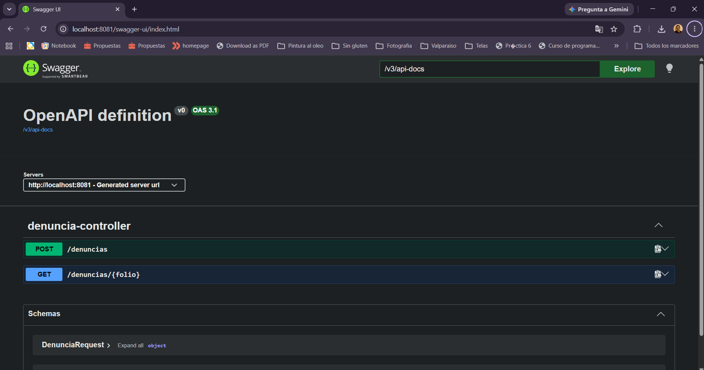

**2. Registrar denuncia — `POST /denuncias` → 201 Created**

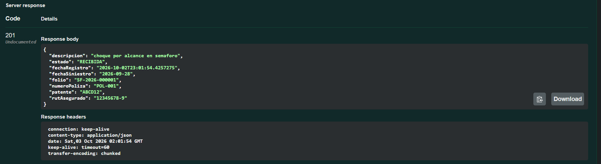

**3. Consultar denuncia por folio — `GET /denuncias/{folio}` → 200 OK**

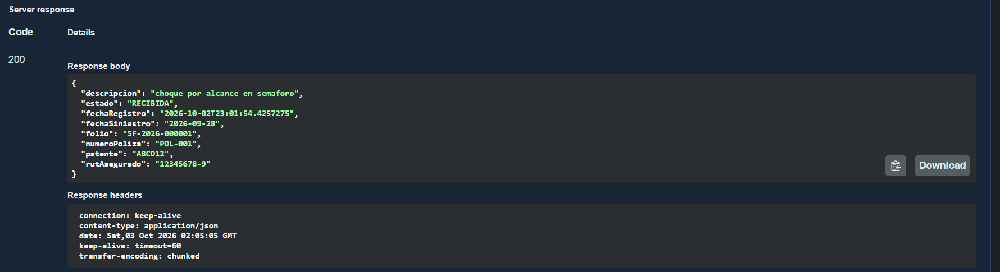

**4. Validación — datos inválidos → 400 Bad Request**

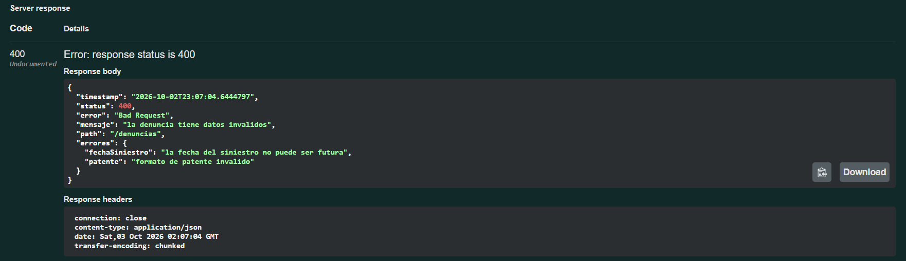

**5. Folio inexistente → 404 Not Found**

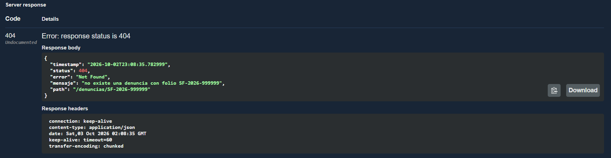

### Postman

**6. Colección importada**

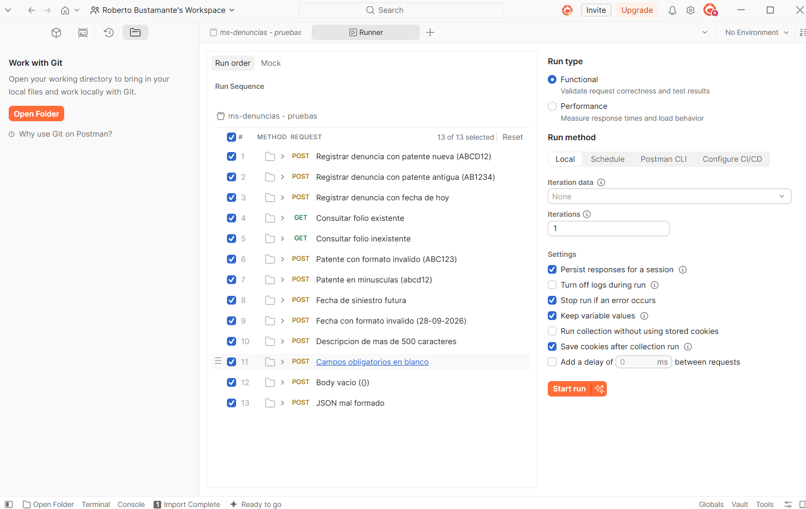

**7. Registrar denuncia → 201 Created con pruebas aprobadas**

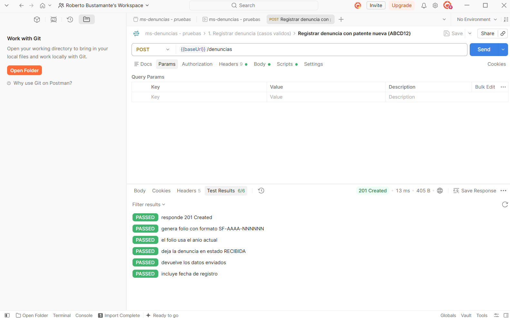

**8. Validación → 400 Bad Request**

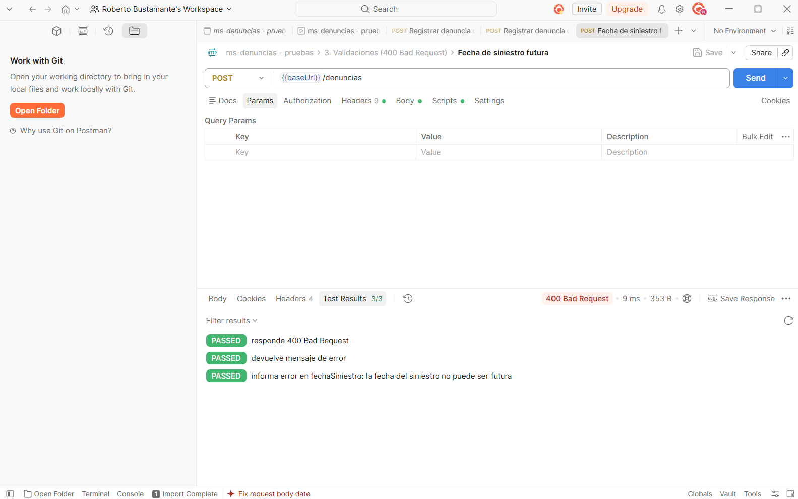

**9. Consulta de folio inexistente → 404 Not Found**

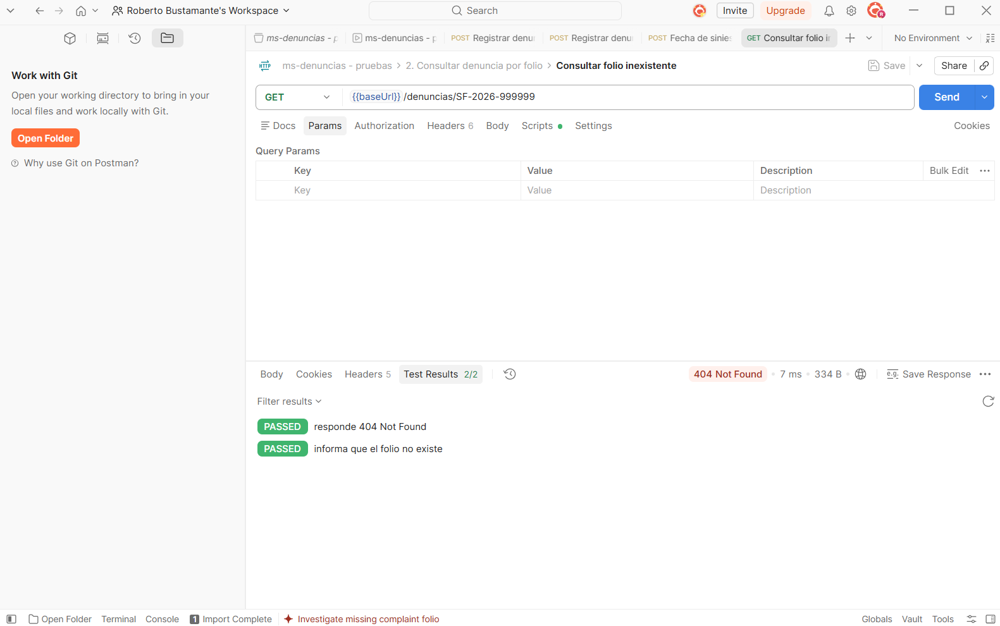

**10. Collection Runner — todas las pruebas aprobadas**

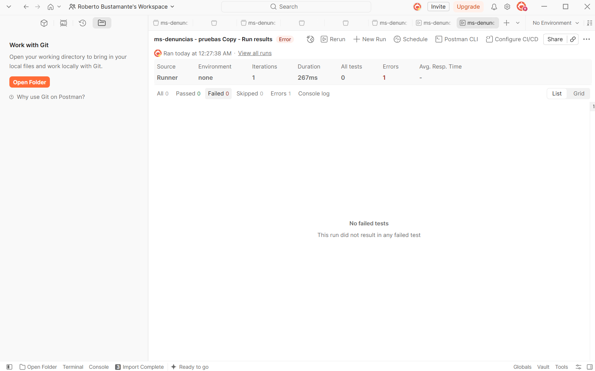

### Docker

**11. Generación del `.jar` — BUILD SUCCESS**

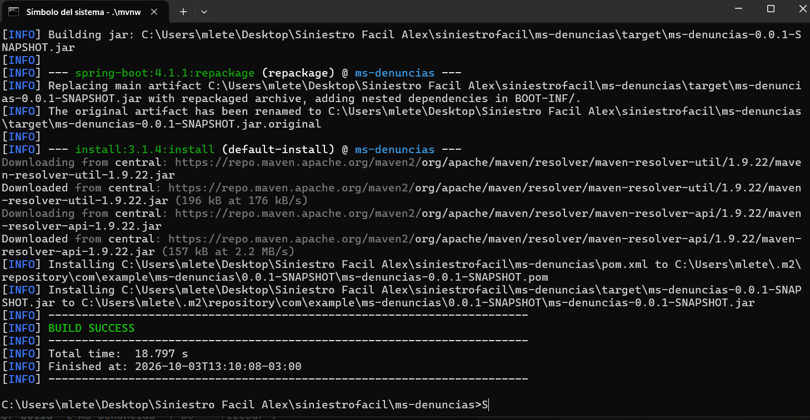

**12. Docker Desktop — contenedores MySQL y microservicio corriendo**

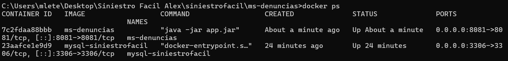

**13. MySQL — denuncias guardadas en la tabla**

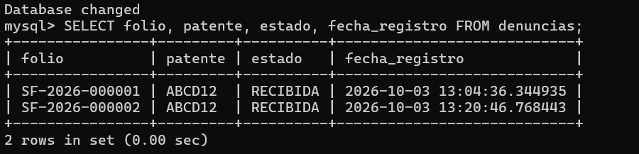

---

## 👥 Equipo

| Integrante |
|---|
| Roberto Bustamante |
| Alex Messin De La Cruz |
| Jahaira Torrijo |

**DUOC UC — Escuela de Informática y Telecomunicaciones**
Asignatura JVY0101 · 2026
